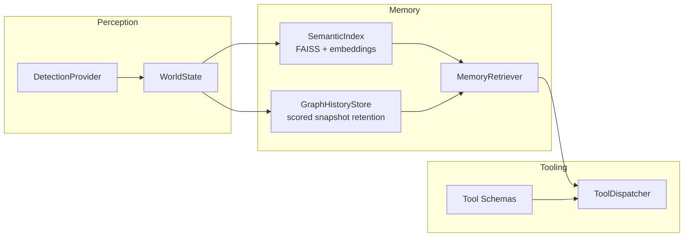

# VIGIL

**Vision-Informed Graph-structured Indexed Ledger**

VIGIL is a lightweight spatial-temporal memory framework for edge and locally-run AI systems. It represents scenes as graphs, giving agents a structured world model, semantic recall, and graph-history (i.e. scene history) retrieval.

This is a framework, so users can design their own model/ui/agent stack.

As a proof-of-concept, we've connected YOLOv26x + BoT-SORT tracking with a local language model (Ministral 3 3B, served via llama.cpp). The latter, having a vision encoder, also acts as the generator of entity descriptions, from which we further generate our text embeddings.

The vision loop passes real-time information about the scene through a world-state graph and event stream, which is then read and actioned upon by agents to detect and describe objects/movements/scenes, to answer questions about what has historically happened in a scene, and to narrate events as they happen.

## Features + Demo

- **Structured world-state representation** — A live scene graph with tracked objects, pairwise spatial relations, motion detection, and event history (see [World State Representation](#world-state-representation) below).
- **Scene History and Entity Memory** — We snapshot and maintain a history of graphs, with a probabilistic scoring and "forgetting" system. Both graphs and entities are retrievable, with the latter supporting vector search. Vector search for graphs is a planned feature after validation. See [Dual-Store Memory System](#dual-store-memory-system) below for more info.
- **Tool calling** — The agent can invoke lookup_entity and describe_scene tools to query its own memory and perception state.
- [Demo] **TUI** — In our demo, we use a simple TUI to observe the status (world version, frame count, etc.) and transcript while interacting with the agent (and monitor event-triggered agent outputs).
- **Graph visualizations** — Periodic snapshots of the world graph rendered via NetworkX and Matplotlib.

## Install

Core package:

```bash
pip install vigil
```

With optional capabilities:

```bash
pip install "vigil[examples]"
```

Or install focused extras:

```bash
pip install "vigil[perception,observability]"
```

Using `uv` in this repo:

```bash
uv sync --all-extras
```

## Quick Start

```python
from vigil.memory import EmbeddingModel, GraphHistoryStore, MemoryRetriever, SemanticIndex

embedding_model = EmbeddingModel()
semantic_index = SemanticIndex(embedding_model)
graph_history = GraphHistoryStore(save_interval_world_versions=10, max_snapshots=100)
retriever = MemoryRetriever(semantic_index=semantic_index, graph_history=graph_history)

semantic_index.add(
    track_id=7,
    object_type="cup",
    description="red ceramic mug near the keyboard",
    indexed_world_version=42,
)

results = retriever.query_context(
    "where is the red mug",
    top_k=3,
    current_visible_track_ids={7},
)

print(results["items"][0]["description"])
```

## Architecture



## Core Components

- `vigil.memory`
  - `EmbeddingModel`: lazy embedding wrapper
  - `SemanticIndex`: FAISS-backed entity index
  - `GraphHistoryStore`: sparse world-graph snapshots with score-aware eviction
  - `MemoryRetriever`: semantic and structured retrieval layer
- `vigil.perception`
  - `WorldState`: thread-safe object/relation/event scene model
  - `DetectionProvider`: protocol for pluggable detectors
  - `detectors.yolo`: default YOLO + BoT-SORT loop (`vigil[perception]`)
- `vigil.tools`
  - `TOOL_SCHEMAS`: tool definitions for LLM tool calling
  - `ToolDispatcher`: execution layer for `lookup_entity` and `describe_scene`
- `vigil.observability`
  - `GraphSnapshotRecorder`: graph PNG snapshots for debugging and analysis

## Examples

- Embodied agent demo app: `examples/embodied_agent/README.md`
- Minimal library usage: `examples/minimal/quickstart.py`

The embodied agent example contains the moved non-core runtime pieces (pipeline orchestration, API ingest server, conversation manager, and Textual UI) to demonstrate how VIGIL can be composed into a full application.

## How It Works

### World State Representation

`perception/yoloworldstate.py` maintains a structured, thread-safe scene graph that transforms raw YOLO detections into a semantic representation suitable for LLM reasoning. The world state is updated every frame and produces JSON snapshots consumed by the prompt builder.

#### WorldObject

Each tracked detection becomes a `WorldObject` with:

| Field                      | Description                                         |
| -------------------------- | --------------------------------------------------- |
| `track_id`                 | Persistent ID from BoT-SORT (survives occlusion)    |
| `type`                     | Class label from YOLO (e.g. `person`, `cell phone`) |
| `center`                   | Bounding box centroid `(x, y)`                      |
| `velocity`                 | Per-frame displacement `(vx, vy)`                   |
| `moving`                   | Boolean motion state with hysteresis                |
| `visible`                  | Whether the object is currently detected            |
| `confidence`               | YOLO detection confidence                           |
| `first_seen` / `last_seen` | Frame lifecycle timestamps                          |

**Motion detection** uses hysteresis to avoid flicker: an object is declared "moving" only after `MOTION_START_CONTINUOUS_FRAME_THRESHOLD` (4) consecutive frames above the speed threshold, and "stopped" only after `MOTION_STOP_CONTINUOUS_FRAME_THRESHOLD` (4) consecutive frames below it. This prevents noisy detections from generating spurious motion events.

**Disappearance detection** marks an object as missing after `DISAPPEARANCE_THRESHOLD` (15) consecutive frames without a matching detection, generating a critical event for the agent.

#### Relation

Pairwise spatial relations are computed between all visible objects using:

- **Direction**: `atan2`-based mapping into 8 compass directions (`above`, `upper right`, `right`, `bottom left`, etc.) representing the relative position of object A with respect to object B.
- **Proximity**: Euclidean distance compared against `DISTANCE_THRESHOLD` (100px) to classify pairs as `near` or `far`.
- **Overlap**: IoU (Intersection over Union) compared against `IOU_THRESHOLD` (0.5) to detect overlapping bounding boxes.

Relations are keyed by `frozenset({id_a, id_b})` and updated incrementally each frame (delta updates, not full recomputation).

#### Event Log

The world state maintains a rolling event log (capped at 20 entries) that records:

- **Appearance**: `"cell_phone_3 appeared at frame 142"`
- **Motion start with direction**: `"person_1 moved left at frame 200"`
- **Motion stop**: `"person_1 stopped at frame 215"`
- **Disappearance**: `"cup_5 disappeared at frame 340"` (triggers `critical` flag)

The `critical` flag signals the agent loop that an event warrants an unprompted response (Event Mode).

#### Snapshot Format

`WorldState.snapshot()` produces a JSON dict consumed by the prompt builder:

```json
{
  "critical": false,
  "world_version": 1042,
  "timestamp": 3150,
  "frame_size": { "width": 1920, "height": 1080 },
  "objects": [
    {
      "id": 1,
      "type": "person",
      "position": { "x": 540, "y": 320 },
      "velocity": { "x": -3, "y": 0 },
      "state": { "visible": true, "moving": true },
      "confidence": 0.9214,
      "first_seen": 10,
      "last_seen": 3150
    }
  ],
  "relations": [
    {
      "subject": "person_1",
      "relation": "right, near, not overlapping",
      "object": "laptop_2",
      "last_updated": 3150
    }
  ],
  "recent_events": [
    "person_1 moved left at frame 3100",
    "cup_5 disappeared at frame 3020"
  ]
}
```

### Dual-Store Memory System

The `memory/` module implements a dual-store architecture that gives the agent both **semantic recall** ("what did I see that looked like X?") and **situational context** ("what was happening around entity Y the last time I saw it?").

#### Semantic Index (`memory/semantic_index.py`)

Entity descriptions (generated by the crop describer from object image crops) are embedded into 384-dimensional vectors using `all-MiniLM-L6-v2` (via `memory/embeddings.py`) and stored in a FAISS `IndexFlatIP` index.

Key design decisions:

- **Normalized embeddings**: All vectors are unit-length, so inner product equals cosine similarity — enabling exact nearest-neighbor search without additional normalization at query time.
- **One entry per track ID**: Each tracked object is indexed at most once (first description wins). This prevents the index from being dominated by repeatedly-seen objects.
- **Lock-minimized writes**: The expensive embedding computation runs outside the critical section; only the FAISS insertion and metadata bookkeeping hold the lock.
- **Flat index**: `IndexFlatIP` performs brute-force exact search. This is appropriate because the entity count is expected to be small (dozens to hundreds per session, not millions).

#### Graph History Store (`memory/graph_history.py`)

The graph history store saves periodic snapshots of the world graph (every N world versions, default 50) in a bounded buffer (default 100 snapshots). When the buffer is full, a **score-based stochastic eviction policy** removes low-value snapshots while preserving temporal diversity.

**Snapshot scoring** combines four weighted components:

| Component                | What it measures                                       | Intuition                                    |
| ------------------------ | ------------------------------------------------------ | -------------------------------------------- |
| Age score                | Exponential decay from current time                    | Recent snapshots are more relevant           |
| Visible entity count     | Ratio of visible entities to a reference count         | Busier scenes carry more information         |
| Description length RMS   | RMS of text description lengths for visible entities   | Richly-described scenes are more valuable    |
| Entity time-in-frame RMS | RMS of `(last_seen - first_seen)` for visible entities | Longer-tracked entities are more established |

**Stochastic eviction**: Rather than deterministically evicting the lowest-scored snapshot, the store uses inverse-score weighted random selection (`weight = 1 / (score + epsilon)`). This means low-scoring snapshots are _likely_ to be evicted but not _guaranteed_ — preserving temporal diversity and preventing the history from clustering around only the most "interesting" moments.

**Protected recent snapshots**: The N most recent snapshots (configurable) are excluded from eviction candidates, ensuring the agent always has access to recent context regardless of score.

**Graph pruning**: Before storage, each snapshot is pruned to include only visible objects and relations where at least one endpoint is visible. This reduces storage overhead and ensures the snapshot reflects the actual observable state.

#### Memory Retriever (`memory/retriever.py`)

The `MemoryRetriever` unifies both stores at query time:

1. **Semantic search** (`query_context`): Embeds the query, searches the FAISS index for top-K matches, and enriches each result with the latest graph context from when that entity was visible.
2. **Full memory dump** (`all_entity_memory_context`): Returns all indexed entity memories sorted by recency, used as auxiliary context in every agent prompt.
3. **Structured lookup** (`lookup_entities`): Filters entities by exact track ID and/or class name, used by the `lookup_entity` tool.

Each result item includes whether the entity is currently visible, its semantic description, the indexed world version, and an optional graph summary showing what objects and relations surrounded it the last time it was seen.

### Agent Reasoning Loop

The agent operates in a continuous loop with two trigger modes:

**Event Mode**: When the world state's `critical` flag is set (currently triggered by object disappearance), the agent generates an unprompted observation. The system prompt instructs it to make inferences ("if something vanishes near a bag, it went in the bag") and keep responses to one sentence.

**User Mode**: When a user sends a message (via TUI text input or voice), the agent answers using up to 3 sentences, grounding its response in the current scene state and memory context.

Each agent turn assembles a prompt from:

1. **System prompt** — Defines the agent's persona and style rules (no markdown, no track IDs, natural language).
2. **Scene state JSON** — Current `WorldState.snapshot()` with objects, relations, and events.
3. **Auxiliary context** — Object descriptions from the crop describer, full entity memory from the semantic index, and (if a user query exists) semantic search results matching the query.
4. **Conversation history** — A sliding window of recent user/assistant turns (configurable depth).

The agent can also invoke tools:

- **`lookup_entity`**: Query memory by track ID or class name. Returns semantic descriptions and the last-visible graph context.
- **`describe_scene`**: Get current scene state, optionally filtered to a spatial region (`left`, `center`, `right`, `top`, `bottom`).
