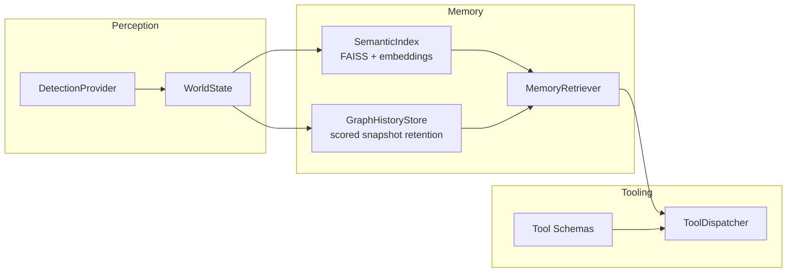

# VIGIL

**Vision-Informed Graph-structured Indexed Ledger**

VIGIL is a lightweight spatial-temporal memory framework for edge and locally-run AI systems. It gives agents a structured world model, semantic recall, and graph-history retrieval without forcing a specific detector, model server, or UI stack.

## Install

Core package:

```bash
pip install vigil
```

With optional capabilities:

```bash
pip install "vigil[examples]"
```

Or install focused extras:

```bash
pip install "vigil[perception,observability]"
```

Using `uv` in this repo:

```bash
uv sync --all-extras
```

## Quick Start

```python
from vigil.memory import EmbeddingModel, GraphHistoryStore, MemoryRetriever, SemanticIndex

embedding_model = EmbeddingModel()
semantic_index = SemanticIndex(embedding_model)
graph_history = GraphHistoryStore(save_interval_world_versions=10, max_snapshots=100)
retriever = MemoryRetriever(semantic_index=semantic_index, graph_history=graph_history)

semantic_index.add(
    track_id=7,
    object_type="cup",
    description="red ceramic mug near the keyboard",
    indexed_world_version=42,
)

results = retriever.query_context(
    "where is the red mug",
    top_k=3,
    current_visible_track_ids={7},
)

print(results["items"][0]["description"])
```

## Architecture



## Core Components

- `vigil.memory`
  - `EmbeddingModel`: lazy embedding wrapper
  - `SemanticIndex`: FAISS-backed entity index
  - `GraphHistoryStore`: sparse world-graph snapshots with score-aware eviction
  - `MemoryRetriever`: semantic and structured retrieval layer
- `vigil.perception`
  - `WorldState`: thread-safe object/relation/event scene model
  - `DetectionProvider`: protocol for pluggable detectors
  - `detectors.yolo`: default YOLO + BoT-SORT loop (`vigil[perception]`)
- `vigil.tools`
  - `TOOL_SCHEMAS`: tool definitions for LLM tool calling
  - `ToolDispatcher`: execution layer for `lookup_entity` and `describe_scene`
- `vigil.observability`
  - `GraphSnapshotRecorder`: graph PNG snapshots for debugging and analysis

## Benchmarks

Benchmark scaffolding lives in `benchmarks/` and covers:

- semantic indexing throughput
- retrieval/query latency
- graph-history save and eviction behavior
- end-to-end perception-to-memory-to-retrieval flow

Run benchmarks:

```bash
uv run --extra dev pytest benchmarks --benchmark-only
```

## Examples

- Embodied agent demo app: `examples/embodied_agent/README.md`
- Minimal library usage: `examples/minimal/quickstart.py`

The embodied agent example contains the moved non-core runtime pieces (pipeline orchestration, API ingest server, conversation manager, and Textual UI) to demonstrate how VIGIL can be composed into a full application.
